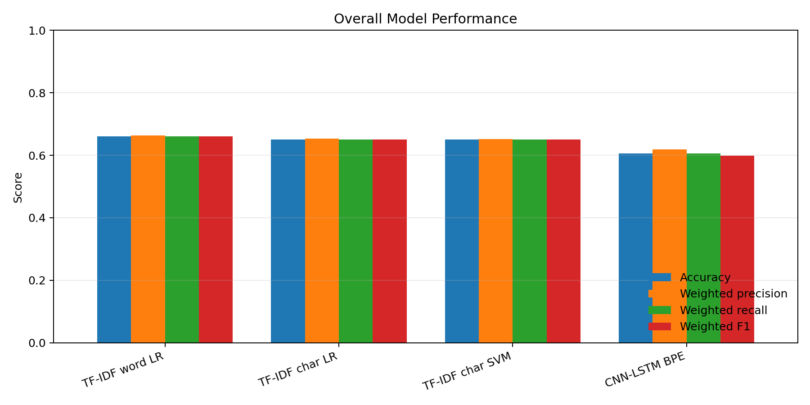
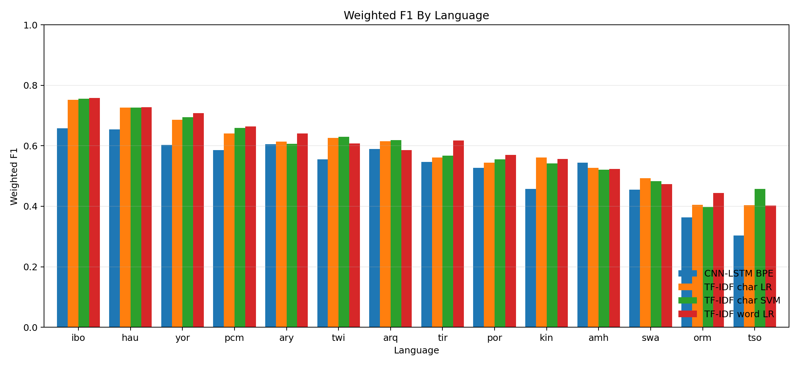

# COS760 Results Summary

## Dataset

- Rows: 111718
- Train / validation / test: 67030 / 22344 / 22344
- Labels: negative, neutral, positive
- Language groups: amh, arq, ary, hau, ibo, kin, orm, pcm, por, swa, tir, tso, twi, yor

## Overall Performance

Best weighted F1: **TF-IDF word LR** (0.660).

| Model | Accuracy | Weighted precision | Weighted recall | Weighted F1 |
| --- | --- | --- | --- | --- |
| TF-IDF word LR | 0.660 | 0.664 | 0.660 | 0.660 |
| TF-IDF char LR | 0.651 | 0.653 | 0.651 | 0.651 |
| TF-IDF char SVM | 0.650 | 0.651 | 0.650 | 0.650 |
| CNN-LSTM BPE | 0.606 | 0.619 | 0.606 | 0.598 |

## Language Robustness

| Model | Language | Accuracy | Weighted F1 |
| --- | --- | --- | --- |
| CNN-LSTM BPE | ibo | 0.678 | 0.658 |
| CNN-LSTM BPE | hau | 0.662 | 0.654 |
| CNN-LSTM BPE | ary | 0.624 | 0.606 |
| CNN-LSTM BPE | yor | 0.637 | 0.603 |
| CNN-LSTM BPE | arq | 0.580 | 0.589 |
| CNN-LSTM BPE | pcm | 0.604 | 0.586 |
| CNN-LSTM BPE | twi | 0.542 | 0.555 |
| CNN-LSTM BPE | tir | 0.544 | 0.546 |
| CNN-LSTM BPE | amh | 0.561 | 0.545 |
| CNN-LSTM BPE | por | 0.581 | 0.528 |
| CNN-LSTM BPE | kin | 0.478 | 0.458 |
| CNN-LSTM BPE | swa | 0.506 | 0.455 |
| CNN-LSTM BPE | orm | 0.381 | 0.363 |
| CNN-LSTM BPE | tso | 0.335 | 0.304 |
| TF-IDF char LR | ibo | 0.754 | 0.752 |
| TF-IDF char LR | hau | 0.726 | 0.726 |
| TF-IDF char LR | yor | 0.693 | 0.686 |
| TF-IDF char LR | pcm | 0.663 | 0.640 |
| TF-IDF char LR | twi | 0.635 | 0.626 |
| TF-IDF char LR | arq | 0.623 | 0.615 |
| TF-IDF char LR | ary | 0.617 | 0.614 |
| TF-IDF char LR | kin | 0.561 | 0.561 |
| TF-IDF char LR | tir | 0.575 | 0.561 |
| TF-IDF char LR | por | 0.579 | 0.545 |
| TF-IDF char LR | amh | 0.537 | 0.528 |
| TF-IDF char LR | swa | 0.535 | 0.493 |
| TF-IDF char LR | orm | 0.413 | 0.405 |
| TF-IDF char LR | tso | 0.392 | 0.404 |
| TF-IDF char SVM | ibo | 0.758 | 0.756 |
| TF-IDF char SVM | hau | 0.727 | 0.727 |
| TF-IDF char SVM | yor | 0.697 | 0.695 |
| TF-IDF char SVM | pcm | 0.673 | 0.660 |
| TF-IDF char SVM | twi | 0.631 | 0.630 |
| TF-IDF char SVM | arq | 0.621 | 0.619 |
| TF-IDF char SVM | ary | 0.607 | 0.606 |
| TF-IDF char SVM | tir | 0.583 | 0.567 |
| TF-IDF char SVM | por | 0.573 | 0.556 |
| TF-IDF char SVM | kin | 0.542 | 0.542 |
| TF-IDF char SVM | amh | 0.527 | 0.520 |
| TF-IDF char SVM | swa | 0.506 | 0.483 |
| TF-IDF char SVM | tso | 0.445 | 0.457 |
| TF-IDF char SVM | orm | 0.401 | 0.397 |
| TF-IDF word LR | ibo | 0.758 | 0.758 |
| TF-IDF word LR | hau | 0.727 | 0.728 |
| TF-IDF word LR | yor | 0.711 | 0.708 |
| TF-IDF word LR | pcm | 0.690 | 0.664 |
| TF-IDF word LR | ary | 0.644 | 0.640 |
| TF-IDF word LR | tir | 0.633 | 0.618 |
| TF-IDF word LR | twi | 0.618 | 0.608 |
| TF-IDF word LR | arq | 0.596 | 0.585 |
| TF-IDF word LR | por | 0.603 | 0.570 |
| TF-IDF word LR | kin | 0.555 | 0.556 |
| TF-IDF word LR | amh | 0.528 | 0.524 |
| TF-IDF word LR | swa | 0.519 | 0.474 |
| TF-IDF word LR | orm | 0.462 | 0.444 |
| TF-IDF word LR | tso | 0.392 | 0.403 |

## Per-Class Metrics

| Model | Class | Precision | Recall | F1 | Support |
| --- | --- | --- | --- | --- | --- |
| CNN-LSTM BPE | negative | 0.558 | 0.763 | 0.645 | 7831 |
| CNN-LSTM BPE | neutral | 0.662 | 0.424 | 0.517 | 7293 |
| CNN-LSTM BPE | positive | 0.641 | 0.619 | 0.630 | 7220 |
| TF-IDF char LR | negative | 0.630 | 0.694 | 0.660 | 7831 |
| TF-IDF char LR | neutral | 0.630 | 0.611 | 0.620 | 7293 |
| TF-IDF char LR | positive | 0.701 | 0.645 | 0.672 | 7220 |
| TF-IDF char SVM | negative | 0.630 | 0.676 | 0.652 | 7831 |
| TF-IDF char SVM | neutral | 0.628 | 0.621 | 0.625 | 7293 |
| TF-IDF char SVM | positive | 0.697 | 0.650 | 0.673 | 7220 |
| TF-IDF word LR | negative | 0.628 | 0.699 | 0.662 | 7831 |
| TF-IDF word LR | neutral | 0.639 | 0.632 | 0.636 | 7293 |
| TF-IDF word LR | positive | 0.728 | 0.646 | 0.684 | 7220 |

## Generated Assets

- `reports/tables/overall_metrics.csv`
- `reports/tables/language_robustness.csv`
- `reports/tables/class_metrics.csv`
- `reports/figures/overall_metrics.png`
- `reports/figures/language_weighted_f1.png`
- `reports/figures/cnn_lstm_training_history.png` when CNN-LSTM history is available
